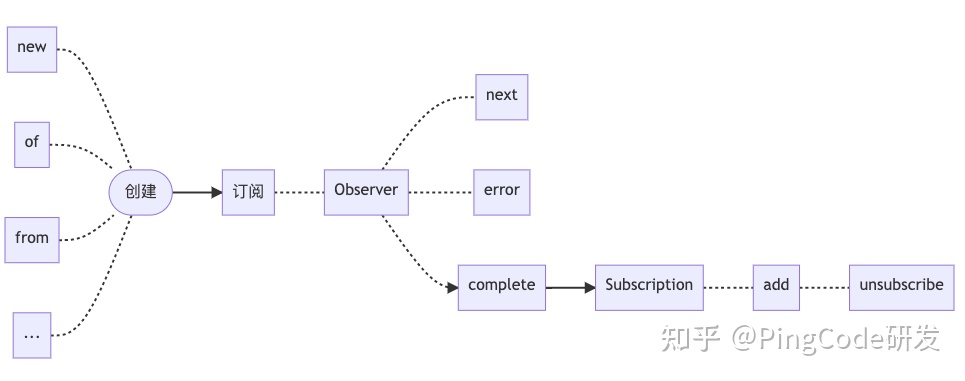

# [rxjs](https://juejin.cn/post/7069572932346839071)

---
> [简介](https://zhuanlan.zhihu.com/p/583539989)
  - RxJS 全称 Reactive Extensions for JavaScript，翻译过来是 Javascript 的响应式扩展，它是一个采用流来处理异步和事件的工具库
  - 简单来说 Rx(JS) = Observables + Operator + Scheduler。

---
> 工作流程
  - 
